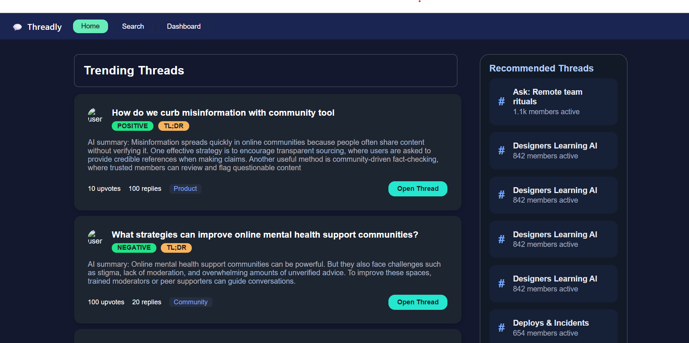
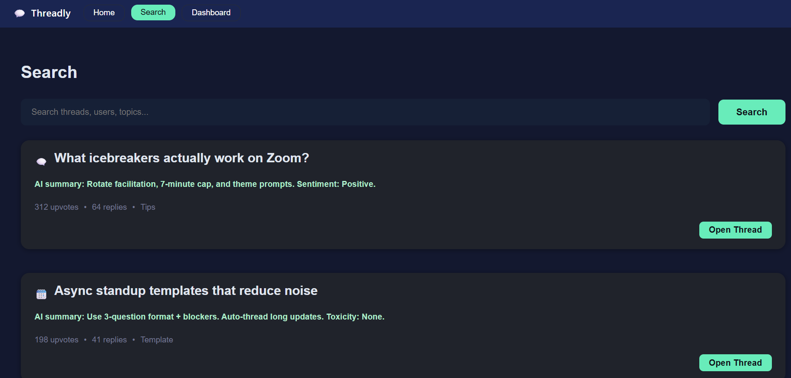

# Threadly 🚀

AI-powered discussion platform with **FastAPI backend**, **React frontend**, and **Supabase database**.  
Threadly enhances community discussions by integrating **Hugging Face Transformers** for:

- 🧠 Automatic summarization of threads  
- 😊 Sentiment analysis of posts  
- 🚫 Toxicity detection to ensure safe conversations  

---

## ✨ Features
- Create and manage threads in real-time  
- AI-generated summaries for quick understanding  
- Sentiment & toxicity analysis of discussions  
- Store threads and comments securely in Supabase  
- Simple and modern UI with React
---
## 📸 Project Screenshots
### 🏠 Home Page

### 🏠 Search Page


---
## 📂 Project Structure
```
Threadly/
│── backend/                     # FastAPI backend
│   ├── app/
│   │   ├── crud/                # Database operations
│   │   ├── models/              # AI Models (sentiment, summary, toxicity)
│   │   ├── routers/             # API routes
│   │   │   ├── thread.py
│   │   │   └── ai.py (or ai2.py)
│   │   ├── schemas/             # Pydantic schemas
│   │   │   └── thread.py
│   │   ├── database.py          # Supabase/Postgres connection
│   │   ├── main.py              # FastAPI entry point
│   │   └── temp.py              # Scratch/test file (optional)
│   ├── venv/                    # Virtual environment
│   ├── requirements.txt         # Python dependencies
│   └── .env                     # Supabase credentials (ignored by git)

│── frontend/                    # React frontend
│   ├── public/                  # Static assets
│   ├── src/
│   │   ├── components/          # Reusable UI components
│   │   ├── pages/               # Page-level components
│   │   │   ├── Dashboard/
│   │   │   │   ├── Dashboard.css
│   │   │   │   └── Dashboard.jsx
│   │   │   ├── Home/            # Home page
│   │   │   └── Search/          # Search page
│   │   ├── App.css
│   │   ├── App.js               # Main React component
│   │   ├── App.test.js
│   │   ├── index.css
│   │   ├── index.js             # React entry point
│   │   ├── logo.svg
│   │   ├── reportWebVitals.js
│   │   └── setupTests.js
│   ├── package.json             # Frontend dependencies
│   ├── package-lock.json
│   └── .gitignore

│── .gitignore                   # Git ignore rules
│── .gitattributes
│── README.md                    # Documentation

```

---

## ⚡ Getting Started

### 1️⃣ Clone the repository
```bash
git clone https://github.com/your-username/Threadly.git
cd Threadly
```
### 2️⃣ Setup Backend (FastAPI)
```bash
cd backend
python -m venv venv

# Activate virtual environment

# On Windows:
venv\Scripts\activate

# On macOS/Linux:
source venv/bin/activate

# Install dependencies
pip install -r requirements.txt

# Run the backend
uvicorn app.main:app --reload
➡️ Backend runs on: http://127.0.0.1:8000
```
### 3️⃣ Setup Frontend (React)
```bash
cd frontend
npm install
npm start
➡️ Frontend runs on: http://localhost:3000
```
### 4️⃣ Configure Environment Variables
```bash
Create a .env file inside backend/ with your Supabase credentials:
SUPABASE_URL=your-supabase-url
SUPABASE_KEY=your-supabase-key
```
---

## 🛠 Tech Stack
Backend: FastAPI + Supabase

Frontend: React

AI Models: Hugging Face Transformers

Database: Supabase (Postgres)

---
## 🤝 Contributing
```
Fork this repo

Create a feature branch (feature/my-feature)

Commit your changes

Push & open a Pull Request
```
---
# 👨‍👩‍👧‍👦 Team
Team Name: Sleepless Neural Networks 

### Members:

Harish Reddy

Anish

Abdul Muqeet

Kush Patel
